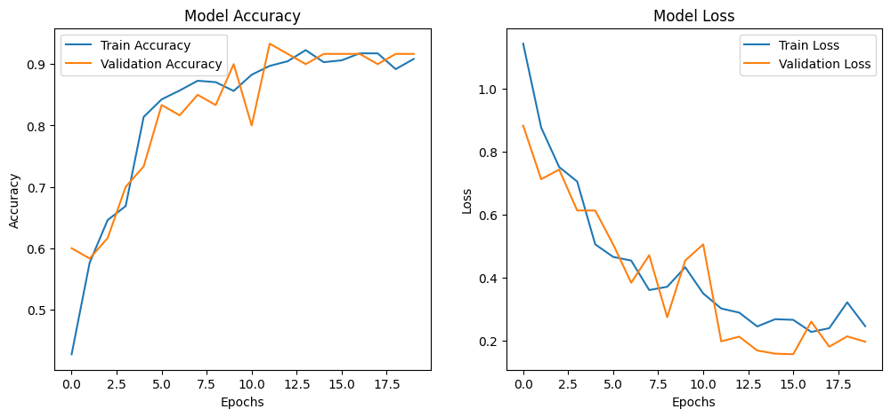

# Plant Disease Detection API 🌱

This project is a **Flask-based API** for detecting plant diseases (**Healthy, Powdery Mildew, Rust**) using a deep learning model. The model is trained on an image dataset and deployed with an endpoint to classify uploaded images.

## 🛠 How It Works
1. **Dataset**: The dataset was obtained from **Kaggle** ([View Dataset](https://www.kaggle.com/datasets/rashikrahmanpritom/plant-disease-recognition-dataset)).
2. **Data Preparation**: Organized into `train`, `test`, and `validation` folders.
3. **Model Training**: A convolutional neural network (CNN) was trained using TensorFlow/Keras to classify plant disease images.
4. **API Development**: A Flask API was created to handle image uploads and return predictions.
5. **Frontend Integration**: The API is connected to an **Expo (React Native) app** for users to upload images and receive disease diagnosis.
6. **Future Plans**: Integration with Gemini AI to provide treatment instructions.

